## Prepwise: GRE Preparation Platform

**Prepwise** is an innovative online platform designed to aid students in preparing for the GRE exam. Our platform is structured to cover various aspects of the GRE, offering practice questions, learning tools, and mock tests to ensure comprehensive preparation. With modules dedicated to both **Quantitative Reasoning** and **Verbal Reasoning**, Prepwise is your go-to resource for mastering the GRE.

### Key Features:

- **Quantitative Reasoning Module**:  
  This module contains a wide range of practice questions focused on the Quantitative Reasoning section of the GRE. It provides users with interactive problem-solving exercises and detailed explanations to help improve their math skills and problem-solving strategies.

- **Verbal Reasoning Module**:  
  Designed to enhance verbal reasoning abilities, this module includes practice questions focused on the verbal section of the GRE. It helps users sharpen their vocabulary, reading comprehension, and Sentence Completion.

- **Flashcards Section**:  
  A valuable learning tool for memorizing vocabulary and solving quantitative problems. This section allows users to study GRE-related vocabulary through flashcards and simultaneously work on quant questions, reinforcing both areas of study.

- **GRE Simulation Tests**:  
  Prepwise offers full-length practice tests that simulate the real GRE exam environment. These tests are designed to give users a sense of the timing and structure of the actual exam. For premium users, we provide detailed **score analysis**, offering insights into their potential GRE scores and suggestions for areas that need improvement.

### Premium User Features:

- **Score Analysis**:  
  Premium users gain access to in-depth score analysis after completing practice tests. This feature provides a breakdown of performance in each section, predicts final GRE scores, and offers tailored recommendations for improving weak areas.

### Tech Stack:

- **Frontend**: ReactJS – A powerful JavaScript library for building user interfaces, ensuring a responsive and dynamic experience for users.
- **Backend**: NodeJS/Express – A JavaScript runtime for building scalable and fast backend services.
- **Database**: MongoDB – A NoSQL database that allows for flexible data storage and quick retrieval of user data, practice questions, and test results.

```mermaid
classDiagram
    class User {
        -int userID
        -String firstName
        -String lastName
        -string username
        -string password
        -string email
        -integer mobileNum
        -bool isPremium

        +takeFullTest()
        +useFlashcard()
        +upgradeToPremium()
        +accessAnalytics()
        +viewProfile()
        +getUserID() : int
        +setUserID(id:int)
        +getFirstName() : string
        +setFirstName(firstname:string)
        +getLirstName() : string
        +setLirstName(lastname:string)
        +getUsername() : string
        +setUsername(name:string)
        +getPassword() : string
        +setPassword(password:string)
        +getEmail() : string
        +setEmail(email:string)
        +getMobile() : int
        +setMobile(id:int)

    }

    class Admin {
        +int adminID
        +string username
        +string password
        +string email
        +createTest(test: Test)
        +updateTest(test: Test)
        +deleteTest(testID: int)
        +createFlashcard(flashcard: Flashcard)
        +updateFlashcard(flashcard: Flashcard)
        +deleteFlashcard(flashcardID: int)
        +processPayment(payment: Payment)
        +getAdminID() : int
        +setAdminID(id:int)
        +getUsername() : string
        +setUsername(name:string)
        +getPassword() : string
        +setPassword(password:string)
        +getEmail() : string
        +setEmail(email:string)
    }

    class Test {
        +int testID
        +string testName
        +string description
        +list questions
        +addQuestion(question: Question)
        +removeQuestion(questionID:int)
        +startTest()
        +submitTest()
        +getTestID() : int
        +setTestID(id:int)
        +getTestName() : string
        +setTestName(name:string)
        +getDescription() : string
        +setDescription(description:string)
        +getQuestions() : list
        +setQuestions(questions:list)
    }

    class Flashcard {
        +int flashcardID
        +string question
        +string[] options
        +string correctOption
        +createFlashcard()
        +updateFlashcard()
        +deleteFlashcard()
        +getFlashcardID() : int
        +setFlashcardID(id:int)
        +getTopic() : string
        +setTopic(topic:string)
        +getDifficultyLevel() : string
        +setDifficultyLevel(level:string)
        +getQuestion() : string
        +setQuestion(question:string)
        +getOptions() : string[]
        +setOptions(options:string[])
        +getCorrectOption() : string
        +setCorrectOption(option:string)
    }

    class Payment {
        +int paymentID
        +float amount
        +string paymentDate
        +string paymentStatus
        +processPayment()
        +getPaymentID() : int
        +setPaymentID(id:int)
        +getAmount() : float
        +setAmount(amount:float)
        +getPaymentDate() : string
        +setPaymentDate(date:string)
        +getPaymentStatus() : string
        +setPaymentStatus(status:string)
    }

    class Progress {
        +int analyticsID
        +int userId
        +int correctAnswers
        +float averageTimePerQuestion
        +string[] weakTopics
        +string userData
        +float averageScore
        +generateReport(userID:int)
        +getAnalyticsID() : int
        +setAnalyticsID(id:int)
        +getUserData() : string
        +setUserData(data:string)
        +getAverageScore() : float
        +setAverageScore(score:float)
        +getInsights() : string
        +setInsights(insight:string)
        +getWeakTopics() : string[]
        +setWeakTopics(weakTopics: string[])
        +setAverageTimePerQuestion(averageTimePerQuestion : float)
        +getAverageTimePerQuestion(): float

    }

    class Question {
        -int questionID
        -string questionText
        -string[] options
        -string correctOption
        -string difficultyLevel
        -Object Section
        +getQuestionID() : int
        +setQuestionID(id:int)
        +getQuestionText() : string
        +setQuestionText(text:string)
        +getOptions() : string[]
        +setOptions(options:string[])
        +getCorrectOption() : string
        +setCorrectOption(option:string)
        +getDifficultyLevel() : string
        +setDifficultyLevel(level:string)
    }

    User  --> Admin
    Admin --> Test
    Admin --> Flashcard
    Question --> Flashcard
    Test o-- Question
    User --> Payment
    User ..> Progress
    Payment --> Progress
    Test --> Progress

```

